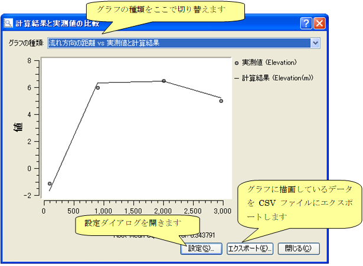

.. _sec_compare_with_measured_data_window:

[Compare with measured values]
================================

.. |compare-window-icon| image:: images/compare-window-icon.png

**Description**: Show dialog to compare calculation results with measured
values.

To use this function you have to import measured data first. Refer to
:ref:`sec_file_import_measured_data` for importing measured data.

Either of the following actions opens a dialog to compare calculation
results with measured values.

**Menu bar**: [Calculation Results] (R) --> [Compare with measured values].

**Operation Toolbar**: |compare-window-icon|

The [Verification Setting] dialog
(:numref:`image_compare_verification_setting_dialog`) will open.
Select data to be used for verification, and click on [OK].
The [Verification] dialog (:numref:`image_compare_verification_dialog`)
will be shown.

.. _image_compare_verification_setting_dialog:

   [Verification Setting] dialog

.. _image_compare_verification_dialog:

   [Verification] dialog
