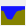
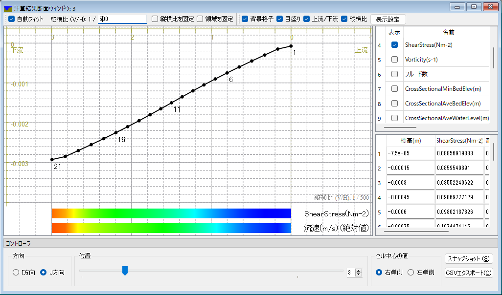

.. _sec_post_crosssection:

断面図描画機能
========================

計算結果の断面図を描画する機能について説明します。

この機能を利用するには、計算結果断面ウィンドウを用います。

新しい断面ウィンドウを開く
----------------------------

新しい断面ウィンドウを開くには、以下のいずれかの操作を行います。

**メニューバー:** 計算結果 (R) --> 新しい断面ウィンドウを開く

**ツールバー:** |cross-section-window-icon|

表示される断面ウィンドウの表示例を :numref:`image_post_crosssection_window` に示します。

計算結果断面ウィンドウの使い方の詳細は、 :ref:`sec_cross-section` を参照してください。

.. _image_post_crosssection_window:

   断面ウィンドウ 表示例
