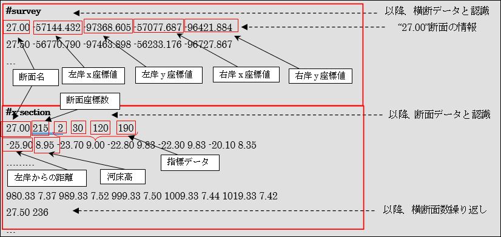

河川測量ファイル（\*.riv）
===========================

概要
---------

河川測量ファイル（*.riv）は、横断データ（左右岸のxy座標）と、
断面データ（左岸からの距離と河床高）からなるファイル形式です。

河川測量ファイルはアスキー形式です。構造と概念を
:numref:`image_riv_structure`、 :numref:`image_riv_concept` に示します。

* 断面名、x座標値などの入力値の区切り文字は、半角スペース、タブ文字、
  改行文字となります。正しく区切られている場合、
  iRIC で自動的に値が認識されます。

* "#survey" 行以降が横断データとして認識されます。

  * 横断データは、1行について1断面の情報からなります。
  * データ行：（断面名）（左岸x座標値）（左岸y座標値）（右岸x座標値）（右岸y座標値）

* "#x-section" 行以降が断面データ（ヘッダ行、データ行から構成）として認識されます。

  * ヘッダ行：（断面名）（断面座標数）（指標1）（指標2）（指標3）（指標4）

  指標1～4は、断面座標の何番目の点かを整数(先頭が1)で指定します。指標1より前、
  指標4より後のデータは捨てられ、指標1で指定した点が左岸、指標4で指定した点が
  右岸に再設定されます。
  また、指標2, 指標3で指定された点には格子の分割点が自動的に設定されます。
  河川中心点は指標2と指標3の中点に設定されます。

  指標データは省略可能です。指標データを省略した場合には、断面座標データがすべて
  読み込まれ、断面座標データの最初の点が左岸、最後の点が右岸となります。
  河川中心点は左岸と右岸の中点に設定されます。
  なお、指標データがすべての断面に設定されていなかった場合、
  全断面の指標データが無視されます。

  * データ行：（左岸からの距離）（河床高）・・・以降、断面座標数分繰り返してください。
    1行に5点まで「左岸からの距離」と「河床高」の断面座標の組が記述できます。

.. _image_riv_structure:

   河川測量ファイルの構造

.. _image_riv_concept:

   河川測量ファイルデータの概念

:numref:`image_riv_concept` は河川測量ファイルデータの概念を
表したものであり、iRICでは指標データの４つの丸印は表示されません。

iRIC の横断面ウィンドウで表示される横断方向の座標は
以下のように変換されたものであり、
河川測量ファイルの断面データにおける「左岸からの距離」とは異なります。

* 横断データと断面データから河川中心点の座標を求める。
* 河川中心点からの横断線上の距離を求める。

河川定期縦横断データ作成ガイドラインの横断測量成果との関係
------------------------------------------------------------

国土交通省では、河川定期縦横断データ作成ガイドラインを
以下の URL で公開しています。

http://www.mlit.go.jp/river/shishin_guideline/kasen/gis/pdf_docs/juoudan/guideline0805.pdf

河川測量データの項目と、このガイドラインに含まれる横断測量成果の数値データの値との
関係について、 :numref:`table_riv_survey_data_guideline` に示します。

.. _table_riv_survey_data_guideline:

.. list-table:: 河川測量データの項目と横断測量成果の数値データの関係
   :header-rows: 1

   * - 河川測量データの項目
     - 横断測量成果の数値データとの関係

   * - 左岸と右岸の座標
     - 左岸距離杭、右岸距離杭の座標を指定します。

   * - 断面データ
     - | 左岸からの距離は、断面の座標データの距離を指定します。
       | 河床高は、断面の座標データの高さを指定します。

   * - 指標データ
     - | 以下のように指定します。
       | 指標1: 左岸距離杭に対応する番号
       | 指標2: 左岸水際杭に対応する番号
       | 指標3: 右岸水際杭に対応する番号
       | 指標4: 右岸距離杭に対応する番号
