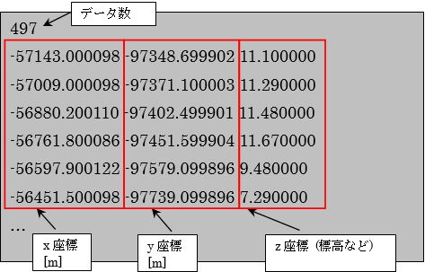

Elevation data file (\*.tpo, \*.anc)
------------------------------------

An Elevation data file (\*.tpo, \*.anc) is a file type for saving the
x-, y- and z- coordinate values of a point.

It can be used as a file type for importing elevation data for iRIC.

The elevation data file is a tab-delimited text file.

The top line shows the number of points in the data and the following
lines are the actual data.

Each column has the following meaning:

-  x-coordinate
-  y-coordinate
-  z-coordinate (elevation, etc.)

.. _image_elevation_example:

   Example of an elevation data file
