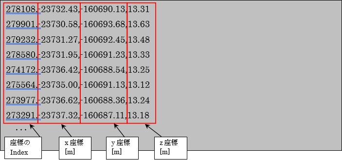

DEMデータファイル（\*.txt）
================================

DEMデータファイル（\*.txt）は、ある点でのxyz座標を保持するファイル形式です。

iRICでは、地勢データをインポートするためのファイル形式の一つとして利用できます。

DEMデータファイルはCSV型式（カンマ（,）区切り型式）であり、単一の平面座標
(x, y)について１つの高さデータを与えます。各列の意味は以下の通りです。

- 座標のインデックス (iRIC では読み飛ばされます)
- x座標
- y座標
- z座標（標高）

.. _image_dem_example:

   DEMデータファイル 例
